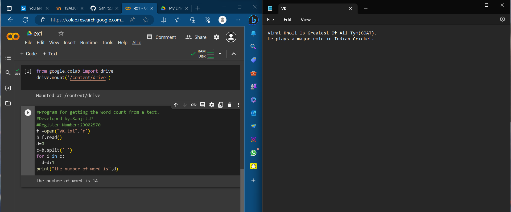

# Word-count
## AIM:
To write a python program for getting the word count from a text.
## EQUIPEMENT'S REQUIRED: 
PC
Anaconda - Python 3.7
## ALGORITHM: 
### Step 1:
Mount your collab with your drive.

### Step 2: 
Open your text file in python code runner.
 
### Step 3: 
Read the file and split the words using spilt().

### Step 4:  
Count the number of words in text file using for loop

### Step 5: 
End the program

## PROGRAM:
```python
#Program for getting the word count from a text.
#Developed by:Sanjit.P
#Register Number:23002570`
from google.colab import drive
drive.mount('/content/drive')

f =open("VK.txt",'r')
b=f.read()
d=0
c=b.split(' ')
for i in c:
  d=d+1
print("the number of word is",d)
```

### OUTPUT:



## RESULT:
Thus the program is written to find the word count from a text.
